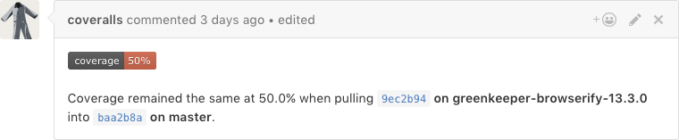

# Coverage reporting

<figure class='-s80'>

</figure>

Tests are often measured by how thorough they are using a metric called *code coverage*.

Code coverage is measured in percentage points. It approximates how much of the system is tested with a given test suite. A code coverage of 80% means that running the test suite ran 80% of the code in the project. The higher the number, the better.

## Why track code coverage

Code coverage is often used to gauge the health of a project's test suite. Coverage will go down when changes are introduced without any tests. It's a good idea to track a project's code coverage to help reviewers gauge code quality of pull requests.

## Code coverage services

CI services don't typically offer code coverage tracking. There are, however, other platforms that offer this. Like CI's, they're typically free for open source projects, with paid plans available for private projects. Here's a list of some popular services:

- [Coveralls.io](https://coveralls.io/) is popular with open source projects.
- [CodeClimate](https://codeclimate.com/) offers code coverage tools as well as other "health" checks.

## Are they worth it?

Code coverage reports offer valuable insight into a project's code quality. Most projects can probably do fine without it, though.

> **Next:** Let's [recap what we've learned](summary.md).
