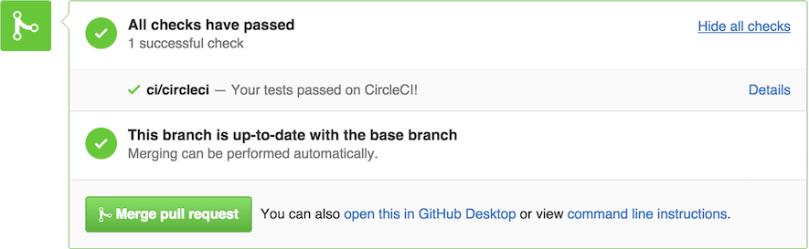

# Automated testing

Having a CI test your code automatically is critical in a branch-based Git workflow. At the very least, you should have a CI service configured for your project to:

- Run tests in every `git push` to your repository.
- Display test results in GitHub and Slack.

## Setting up automated testing

Set up your CI to run tests on every Git push. The steps for this varies for every CI service, so consult your CI manual for details. Typically, this means listing a set of commands that your CI will run when it detects changes. Here's a contrived example:

```sh
# Example CI script for Node.js and Ruby
npm install
bundle install --path=vendor/bundle
npm test
bundle exec rspec
```

## GitHub integration

<figure class='-s80'>

</figure>

When reviewing pull requests, you'll need to ensure that the tests are adequate and passing. A CI service can automate running tests for you and display those results on GitHub.

Most CI services integrate with GitHub and other Git hosting platforms. This helps enforce good pull request hygiene: every code change needs tests, and they all need to pass before merging.

<details>
<summary>See also...</summary>

<ul>
<li><a href='../git/reviewing.md'>§ Reviewing pull requests</a></li>
</ul>

<h4>External links</h4>

<ul>
<li><a href='https://help.github.com/articles/about-statuses/'>About statuses</a> (github.com)</li>
</ul>
</details>

> **Next:** Let's [automate deployments](deployment.md).
