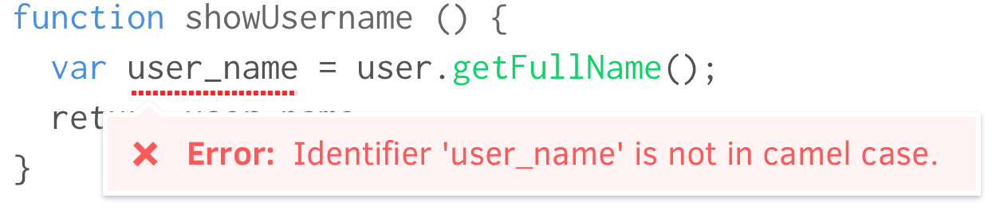

# Linting

<figure class='-bordered -w60'>

</figure>

Linters are tools that enforce source code writing style based on a set of rules. It helps impose coding styleguides in an automated way. A linter will check decisions such as:

- Syntax errors
- Tabs or spaces for indentation
- Naming of variables and functions
- Use of whitespace
- Patterns to use and to avoid

It's important to keep your coding style consistent. Even if it's mostly subjective, a consistent style helps maintain developer sanity and code readability.

## Automated linting

Linting should be part of your automated test suite. This lets you catch style violations before pull requests are merged. Here's an example using Travis CI:

```yaml
# Example .travis.yml configuration to run CS
# and JavaScript linting
script:
  - npm test
  - npm run stylelint
  - npm run eslint
```

## Why use a linter

Linting helps reviewers by catching style violations in automated tests so they don't have to. This means less effort needed for reviewing, and instant feedback for contributors.

<figure class='-w80'>

<figcaption>Linting prevents merging when style issues aren't fixed.</figcaption>
</figure>

## Choose a coding style

There are many established styleguides and linter presets. Pick one and customize it if preferred. It doesn't matter which you choose, what's important is that your team has an authoritative set of rules that are enforced by a linter. This prevents petty "bikeshedding" arguments within your team. Here are some popular examples:

- JavaScript: [Standard](http://standardjs.com/), [XO](https://www.npmjs.com/package/xo)
- CSS: [Config standard](https://www.npmjs.com/package/stylelint-config-standard)
- Ruby: [Ruby Style Guide](https://github.com/bbatsov/ruby-style-guide) (via Rubocop)

## Linter examples

- [Stylelint](http://stylelint.io/) for CSS
- [Eslint](http://eslint.org/) for JavaScript
- [Rubocop](https://github.com/bbatsov/rubocop) for Ruby
- [Credo](https://github.com/rrrene/credo) for Elixir

> **Next:** Make sure your project has a [Readme file](readme_files.md).
