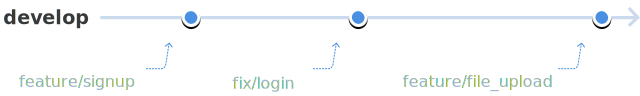
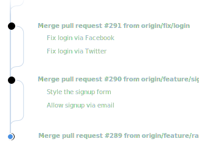

Main branches
=============

There are two main branches to be maintained `master` and `develop`.

The develop branch
------------------

The `develop` branch is what we consider the main branch. All everyday work will be merged into develop. Nobody should push commits directly into this branch. In fact, this branch should only have merge commits from feature branches.

Staging servers are usually set up to mirror what the current state of `develop` is. An [automated deployment](automated_deployments.md) workflow will take care of this.

The master branch
-----------------

The `master` is maintained to be in a *production-ready* state. In practice, the `master` branch is often a mirror of what code is running in production at any given moment.

At the end of a [sprint](#), the `develop` branch will be merged into master. This effectively promotes the current development version into a production version. From then, [automated deployments](automated_deployments.md) will take care of deploying it to production.
