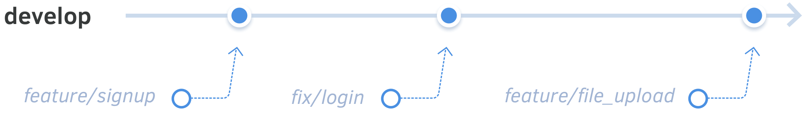

# Main branches

There are two main branches to be maintained: `master` and `develop`.

## The develop branch

The `develop` branch is what we consider the main branch. Feature branches merge into this branch.

<figure class='-bordered'>

</figure>

Nobody should push commits directly into this branch. Instead, work starts by creating feature branches from `develop`. They'll be merged back in when finished. In practice, the `develop` branch only has merge commits from feature branches.

<figure class='-bordered'>

</figure>

The `develop` branch is always in a "ready to test" state. All automated tests should always be passing in this branch. You should also set up a staging server to sync with the latest `develop` version for testing (see [automated deployments](automated_deployments.md)).

## The master branch

The `master` is maintained to be in a *production-ready* state. While the `develop` branch is ready for developers and testers, the `master` branch is ready for users.

<figure class='-bordered'>

</figure>

At the end of a sprint, the `develop` branch will be merged into `master`. This effectively promotes the current development version into a production version. From then, automated deployments will take care of deploying it to production. This means whatever's live on production at any moment is always what's the latest on `master`.

See also...

<ul>
<li><a href='../automation/README.md'>§ Automation</a> describes how you can synchronize your staging servers with the develop branch.</li>
</ul>

> **Next:** Let's start working by [creating a feature branch](feature_branches.md).
