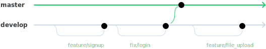

# Main branches

There are two main branches to be maintained: `master` and `develop`.

## The develop branch

The `develop` branch is what we consider the main branch.

Nobody should push commits directly into this branch. Instead, work starts by creating [feature branches] from *develop*. They'll be merged back in when finished. In practice, the *develop* branch often only has merge commits from feature branches.

[feature branches]: feature_branches.md

The *develop* branch is always in a "ready to test" state. All automated tests should always be passing in this branch. A staging server is often available with the latest *develop* version ready to test (see [automated deployments](automated_deployments.md)).

## The master branch

The `master` is maintained to be in a *production-ready* state. While the *develop* branch is ready for developers and testers, the *master* branch is ready for users.

At the end of a [sprint](#), the `develop` branch will be merged into *master*. This effectively promotes the current development version into a production version. From then, [automated deployments](automated_deployments.md) will take care of deploying it to production. This means whatever's live on production at any moment is always what's the latest on `master`.

> **Next:** Let's start working by [creating a feature branch](feature_branches.md).
