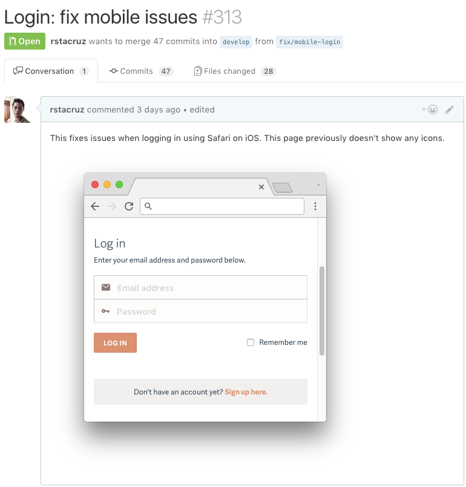
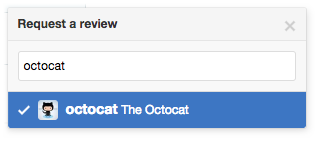

# Pull requests

GitHub's Pull Request feature is used to ask your team to merge a branch in. This is perfect for our branch-based approach of working in branches and asking your teammates to review them.

## Creating pull requests

Create a pull request from your feature branch (eg, `feature/login`) into the main branch (ie, `develop`). This is usually created before, or just around the time, a feature branch is finished.

<figure>

</figure>

## Writing a pull request

Write a short title for your pull request. A good format to follow is:

```
<Feature>: <changes>
```

Write a short paragraph summarizing your changes. Include these additional details as well:

- Screenshots. This helps reviewers understand the context of your changes.
- Note if there's anything missing.
- Links to relevant issues (in Trello, Pivotal Tracker, and alike).

Here's an example of a simple pull request:

<figure class='-bordered'>

<figcaption>A pull request example with a screenshot.</figcaption>
</figure>

## Requesting a review

When a feature branch is finished, tag it as *For review* and request for review. It's then your reviewer's job to understand your changes. This way, knowledge is always shared between at least 2 people; there'll be no part of your project that only one person knows about.

<figure>

</figure>

<details>
<summary>See also...</summary>

<ul>
<li><a href='https://help.github.com/articles/about-pull-requests/'>About pull requests</a></li>
<li><a href='https://help.github.com/articles/creating-a-pull-request/'>Creating a pull request</a></li>
<li><a href='https://help.github.com/articles/about-pull-request-reviews/'>About pull request reviews</a></li>
</ul>
</details>

> **Next:** [Reviewing pull requests](reviewing.md)
