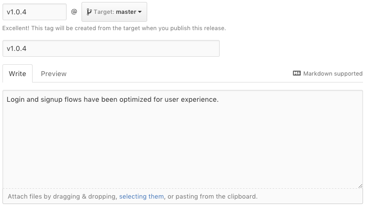

# Building a release

A release is simply a merge commit in `master`. To build a release, you'll need to do these steps:

0. Merge `develop` into `master`.
0. Merge `master` back into `develop` (if needed).
0. Create a release.

## Merging into a clean master

For clean merges of `develop` into `master`, you can use the GitHub interface. Simply create a pull request from `develop` into `master` and merge it using the GitHub website. This works when `master` is clean and up-to-date with the latest `develop` branch, and has no merge conflicts.

## Merging into a dirty master

If `master` has changes that are out-of-sync with `develop`, you may run into merge conflicts. The only way to resolve this is by using the command line. This is the only time pushing directly into `master` is acceptable.

```sh
# Switch to the master branch
git checkout master

# Merge develop into master; do a fetch first
# to ensure we have the latest origin/develop
get fetch
git merge origin/develop

# Resolve any conflicts and commit the result
git mergetool
git commit

# Push into master
git push
```

## Synchronizing develop

There are commits in `master` that are not in `develop`, it may be a good time to merge those into `develop`. Make a pull request of `master` back into `develop`. Doing this is not necessary, but it will clean up your git history.

## Creating a release

Every deployment should have a version number tag. Simply create a release in GitHub. This will create a git tag for you (equivalent to `git tag v1.0.4 master && git push --tags`).

- Create a GitHub release for the latest `master`.
- Tag it in the format `vX.X.X` (eg, `v1.0.4`).

<figure class='-bordered'>

<figcaption>Creating a new GitHub release.</figcaption>
</figure>

> **Next**: [Emergency fixes](hotfix.md)
